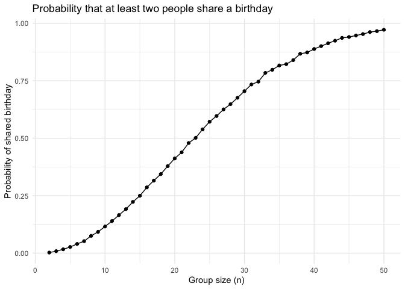
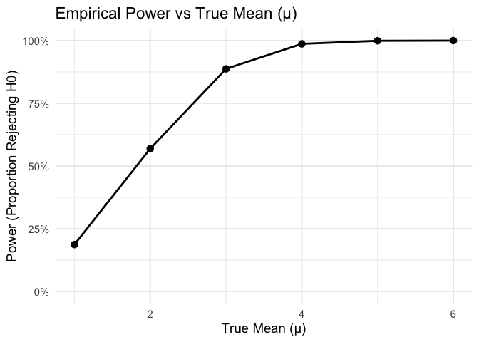
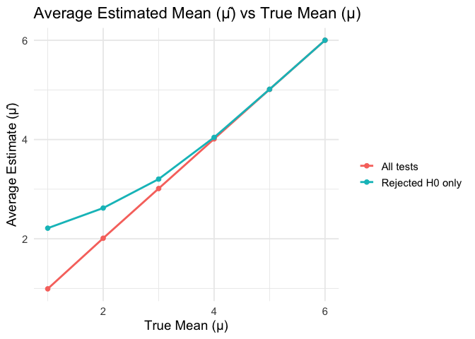
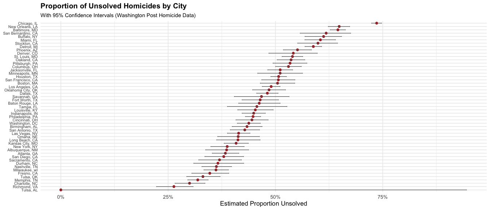

HW 5
================
Jake Vettoretti
2025-11-06

``` r
library(broom)
library(tidyverse)
```

    ## ── Attaching core tidyverse packages ──────────────────────── tidyverse 2.0.0 ──
    ## ✔ dplyr     1.1.4     ✔ readr     2.1.5
    ## ✔ forcats   1.0.0     ✔ stringr   1.5.1
    ## ✔ ggplot2   3.5.2     ✔ tibble    3.3.0
    ## ✔ lubridate 1.9.4     ✔ tidyr     1.3.1
    ## ✔ purrr     1.1.0     
    ## ── Conflicts ────────────────────────────────────────── tidyverse_conflicts() ──
    ## ✖ dplyr::filter() masks stats::filter()
    ## ✖ dplyr::lag()    masks stats::lag()
    ## ℹ Use the conflicted package (<http://conflicted.r-lib.org/>) to force all conflicts to become errors

``` r
library(forcats)
set.seed(1)
```

## Problem 1

``` r
# Define simulation function
bday_sim = function(n_room) {
  birthdays = sample(1:365, n_room, replace = TRUE)
  repeated_bday = length(unique(birthdays)) < n_room
  return(repeated_bday)
}

# Run simulation for group sizes 2–50, with 10,000 iterations each
bday_sim_results = 
  expand_grid(
    bdays = 2:50,
    iter = 1:10000
  ) |> 
  mutate(
    result = map_lgl(bdays, bday_sim) #returns logical vector
  ) |> 
  group_by(
    bdays
  ) |> 
  summarize(
    prob_repeat=mean(result)
  )

bday_sim_results
```

    ## # A tibble: 49 × 2
    ##    bdays prob_repeat
    ##    <int>       <dbl>
    ##  1     2      0.0024
    ##  2     3      0.0085
    ##  3     4      0.0167
    ##  4     5      0.0267
    ##  5     6      0.0399
    ##  6     7      0.0521
    ##  7     8      0.0751
    ##  8     9      0.0925
    ##  9    10      0.116 
    ## 10    11      0.139 
    ## # ℹ 39 more rows

``` r
# Plot results
bday_sim_results |> 
  ggplot(aes(x = bdays, y = prob_repeat)) +
  geom_point() +
  geom_line() +
  labs(
    x = "Group size (n)",
    y = "Probability of shared birthday",
    title = "Probability that at least two people share a birthday"
  ) +
  theme_minimal()
```

<!-- -->

Comments: The plot shows that the probability that at least two people
share a birthday increases quickly as the number of people in the room
grows. When only a few people are present the chance of a shared
birthday is very small but the probability rises sharply as the group
becomes larger. Around twenty three people the probability reaches about
fifty percent and by forty people it is close to one hundred percent.
This finding illustrates the birthday paradox where even small groups
have a surprisingly high chance of sharing a birthday because the number
of possible pairs increases rapidly with group size.

## Question 2

Part 1, mu = 0

``` r
#Setting the design elements
n = 30        # sample size
sigma = 5     # population SD
mu = 0        # true mean
n_sims = 5000 # number of simulated datasets

#Part 1, simulate 5000 datasets and test H0: mu=0
sim_mu0 =
  tibble(iter = 1:n_sims) |>
  mutate(
    results = map(iter, \(i) {
      tibble(x = rnorm(n, mean = mu, sd = sigma)) |>
        summarize(test = list(tidy(t.test(x, mu = 0)))) |>
        unnest(cols = c(test)) |>
        select(estimate, p.value)
    })
  ) |>
  unnest(cols = c(results))


#Part 1, checking model

sim_mu0 |>
  summarize(
    avg_mu_hat = mean(estimate),
    sd_mu_hat  = sd(estimate),
    type1error_rate = mean(p.value < 0.05)
  )
```

    ## # A tibble: 1 × 3
    ##   avg_mu_hat sd_mu_hat type1error_rate
    ##        <dbl>     <dbl>           <dbl>
    ## 1    0.00500     0.911            0.05

Part 2, mu = 1:6

``` r
n = 30
sigma = 5
mu_values = 1:6
n_sims = 5000

# Repeat simulation for each μ
sim_results =
  map_df(mu_values, \(m) {
    tibble(iter = 1:n_sims) |>
      mutate(
        results = map(iter, \(i) {
          tibble(x = rnorm(n, mean = m, sd = sigma)) |>
            summarize(test = list(tidy(t.test(x, mu = 0)))) |>
            unnest(cols = c(test)) |>
            select(estimate, p.value)
        })
      ) |>
      unnest(cols = c(results)) |>
      mutate(mu = m)
  })

# Check one example
sim_results |> 
  group_by(mu) |> 
  summarize(power = mean(p.value < 0.05))
```

    ## # A tibble: 6 × 2
    ##      mu power
    ##   <int> <dbl>
    ## 1     1 0.187
    ## 2     2 0.569
    ## 3     3 0.887
    ## 4     4 0.987
    ## 5     5 0.999
    ## 6     6 1

Plotting power vs mu

``` r
power_df =
  sim_results |>
  group_by(mu) |>
  summarize(
    power = mean(p.value < 0.05),
    .groups = "drop"
  )

power_df |>
  ggplot(aes(x = mu, y = power)) +
  geom_point(size = 3) +
  geom_line(linewidth = 1) +
  scale_y_continuous(limits = c(0, 1), labels = scales::percent_format()) +
  labs(
    title = "Empirical Power vs True Mean (μ)",
    x = "True Mean (μ)",
    y = "Power (Proportion Rejecting H0)"
  ) +
  theme_minimal(base_size = 14)
```

<!-- -->

Describe the association between effect size and power: As effect size
increases, so does power. The two have a positive relationship and
eventually reach a threshold where no more power can be achieved.

Make a plot showing the average estimate of 𝜇̂ on the y axis and the true
value of 𝜇on the x axis with overlay on the first the average estimate
of 𝜇̂ only in samples for which the null was rejected on the y axis and
the true value of 𝜇on the x axis.

``` r
bias_df =
  sim_results |>
  group_by(mu) |>
  summarize(
    mean_est_all = mean(estimate),
    mean_est_sig = mean(estimate[p.value < 0.05]),
    .groups = "drop"
  )

bias_df
```

    ## # A tibble: 6 × 3
    ##      mu mean_est_all mean_est_sig
    ##   <int>        <dbl>        <dbl>
    ## 1     1        0.992         2.21
    ## 2     2        2.01          2.62
    ## 3     3        3.01          3.20
    ## 4     4        4.01          4.04
    ## 5     5        5.01          5.01
    ## 6     6        6.00          6.00

``` r
bias_df |>
  ggplot(aes(x = mu)) +
  geom_line(aes(y = mean_est_all, color = "All tests"), linewidth = 1) +
  geom_point(aes(y = mean_est_all, color = "All tests"), size = 2) +
  geom_line(aes(y = mean_est_sig, color = "Rejected H0 only"), linewidth = 1) +
  geom_point(aes(y = mean_est_sig, color = "Rejected H0 only"), size = 2) +
  labs(
    title = "Average Estimated Mean (μ̂) vs True Mean (μ)",
    x = "True Mean (μ)",
    y = "Average Estimate (μ̂)",
    color = ""
  ) +
  theme_minimal(base_size = 14)
```

<!-- --> Is
the sample average of 𝜇̂ across tests for which the null is rejected
approximately equal to the true value of 𝜇? Why or why not

No, the sample average of mu across tests for which the null hypothesis
was rejected is not approximately equal to the true value of mu,
especially when the true mean is small. The plot shows that while the
average estimate across all tests (red line) closely follows the true
mean—indicating that mu is an unbiased estimator overall, the average
estimate among only significant tests (blue line) is consistently higher
for smaller true means. This occurs because when the true effect size is
small, only samples where random variation inflates mu enough to achieve
significance are included. As a result, the conditional mean of mu given
that p\<0.05p \< 0.05p\<0.05 is biased upward.However, as the true mean
increases and power approaches one, nearly all samples reject the null
hypothesis, so this selection effect disappears and the conditional
average of mu becomes approximately equal to the true value of mu.

\## Problem 3

Loading the data

``` r
homicides <- read_csv("https://raw.githubusercontent.com/washingtonpost/data-homicides/master/homicide-data.csv")
```

    ## Rows: 52179 Columns: 12
    ## ── Column specification ────────────────────────────────────────────────────────
    ## Delimiter: ","
    ## chr (9): uid, victim_last, victim_first, victim_race, victim_age, victim_sex...
    ## dbl (3): reported_date, lat, lon
    ## 
    ## ℹ Use `spec()` to retrieve the full column specification for this data.
    ## ℹ Specify the column types or set `show_col_types = FALSE` to quiet this message.

Description of data: This is a large dataset containing 52,179
observations and 12 different variables. The dataset looks at the date
of the victim’s homicide, the victim’s name, where the homicide
occurred, and the case status of the homicide. It also includes
demographics of the victims like age and sex.

Starting to clean and summarize

``` r
#creating city_state
homicides = homicides |> 
  mutate(
    city_state = str_c(city, ", ", state)
  )

# summarise totals and unsolved by city
city_summary <- homicides |> 
  group_by(city_state) |> 
  summarize(
    total_homicides = n(),
    unsolved_homicides = sum(disposition %in% c("Closed without arrest", "Open/No arrest"), na.rm = TRUE),
    .groups = "drop"
  ) |> 
  arrange(desc(total_homicides))

city_summary
```

    ## # A tibble: 51 × 3
    ##    city_state       total_homicides unsolved_homicides
    ##    <chr>                      <int>              <int>
    ##  1 Chicago, IL                 5535               4073
    ##  2 Philadelphia, PA            3037               1360
    ##  3 Houston, TX                 2942               1493
    ##  4 Baltimore, MD               2827               1825
    ##  5 Detroit, MI                 2519               1482
    ##  6 Los Angeles, CA             2257               1106
    ##  7 St. Louis, MO               1677                905
    ##  8 Dallas, TX                  1567                754
    ##  9 Memphis, TN                 1514                483
    ## 10 New Orleans, LA             1434                930
    ## # ℹ 41 more rows

Using prop.test function

``` r
#filtering
baltimore_df =
  homicides |> 
  filter(city_state == "Baltimore, MD")

#obtaining counts for prop.test
n_unsolved = sum(baltimore_df$disposition %in% c("Closed without arrest", "Open/No arrest"))
n_total = nrow(baltimore_df)

#prop.test
baltimore_test = prop.test(x = n_unsolved, n = n_total)

#tidying
baltimore_tidy = tidy(baltimore_test)
baltimore_tidy
```

    ## # A tibble: 1 × 8
    ##   estimate statistic  p.value parameter conf.low conf.high method    alternative
    ##      <dbl>     <dbl>    <dbl>     <int>    <dbl>     <dbl> <chr>     <chr>      
    ## 1    0.646      239. 6.46e-54         1    0.628     0.663 1-sample… two.sided

``` r
#pulling estimate and CI
baltimore_tidy |> 
  select(estimate, conf.low, conf.high)
```

    ## # A tibble: 1 × 3
    ##   estimate conf.low conf.high
    ##      <dbl>    <dbl>     <dbl>
    ## 1    0.646    0.628     0.663

Now running prop.test for each city in dataset

``` r
city_results =
  city_summary |> 
  mutate(
    prop_test = map2(unsolved_homicides, total_homicides, \(x, n) prop.test(x, n)),
    tidy_result = map(prop_test, tidy)
  ) |> 
  unnest(cols = tidy_result)
```

    ## Warning: There was 1 warning in `mutate()`.
    ## ℹ In argument: `prop_test = map2(...)`.
    ## Caused by warning in `prop.test()`:
    ## ! Chi-squared approximation may be incorrect

``` r
city_results |> 
  select(city_state, estimate, conf.low, conf.high)
```

    ## # A tibble: 51 × 4
    ##    city_state       estimate conf.low conf.high
    ##    <chr>               <dbl>    <dbl>     <dbl>
    ##  1 Chicago, IL         0.736    0.724     0.747
    ##  2 Philadelphia, PA    0.448    0.430     0.466
    ##  3 Houston, TX         0.507    0.489     0.526
    ##  4 Baltimore, MD       0.646    0.628     0.663
    ##  5 Detroit, MI         0.588    0.569     0.608
    ##  6 Los Angeles, CA     0.490    0.469     0.511
    ##  7 St. Louis, MO       0.540    0.515     0.564
    ##  8 Dallas, TX          0.481    0.456     0.506
    ##  9 Memphis, TN         0.319    0.296     0.343
    ## 10 New Orleans, LA     0.649    0.623     0.673
    ## # ℹ 41 more rows

Plotting the homicide estimates and CIs

``` r
#arranging cities by unsolved homicides
city_results |>
  ggplot(aes(x = fct_reorder(city_state, estimate), y = estimate)) +
  geom_point(color = "firebrick", size = 2) +
  geom_errorbar(aes(ymin = conf.low, ymax = conf.high), width = 0.2, color = "gray40") +
  coord_flip() +   # ✅ flips cities vertically, text now easy to read
  labs(
    title = "Proportion of Unsolved Homicides by City",
    subtitle = "With 95% Confidence Intervals (Washington Post Homicide Data)",
    x = NULL,
    y = "Estimated Proportion Unsolved"
  ) +
  scale_y_continuous(labels = scales::percent_format(accuracy = 1)) +
  theme_minimal(base_size = 13) +
  theme(
    axis.text.y = element_text(size = 8),
    plot.title = element_text(face = "bold", size = 15),
    plot.subtitle = element_text(size = 11)
  )
```

<!-- -->
